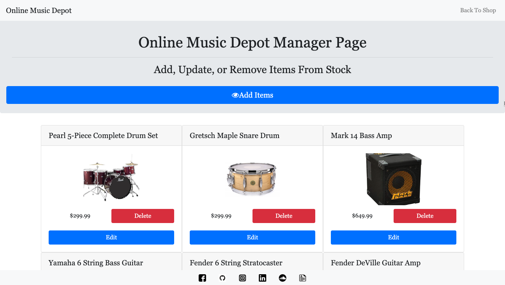

# Bamazon - Online Music Depot

An online storefront simulator. This app includes a store front where customers can buy items if they are in stock, and a manager page where managers can edit or delete items in the store, as well as add items to the store. 

## Getting Started

Please install all dependencies needed to run this program. You should only need to navigate to the root of the project directory and run npm install in your terminal. 

## Deployment

This app was deployed using heroku and jawsDB.

## Built With

* [Bootstrap](https://getbootstrap.com/docs/4.3/getting-started/introduction/)
* [jQuery](https://api.jquery.com/)
* [Node.js](https://nodejs.org/en/docs/)
* [Exress.js](https://expressjs.com/en/starter/installing.html)
* [Sequelize](http://docs.sequelizejs.com/)
* [MySQL](https://dev.mysql.com/doc/)

## Contributing

Please read [CONTRIBUTING.md](https://gist.github.com/PurpleBooth/b24679402957c63ec426) for details on our code of conduct, and the process for submitting pull requests to us.

## Authors

* **Alex Eversbusch** 

## Version

V1.0

## Screenshots
## Store Front

## Manager Login

## Manager Page

## Add Items Page

